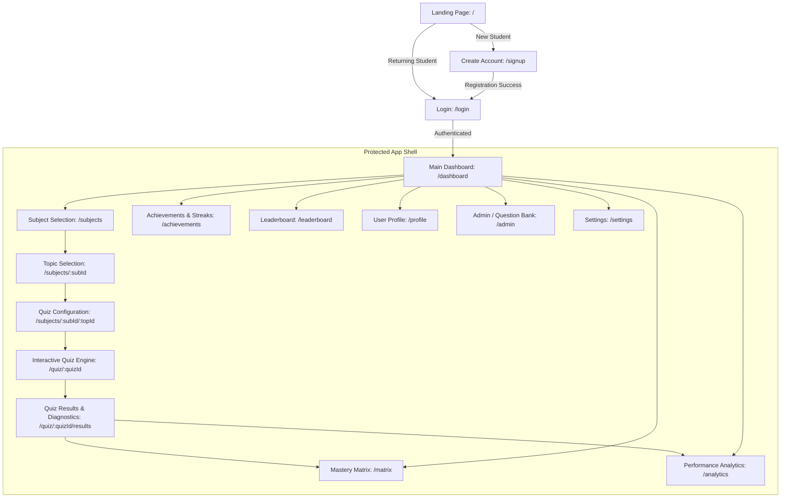

# Pharmaceutics Mastery Matrix (PMM)
## Comprehensive Architecture & Implementation Plan

> **Brand**: Pharmaceutics Mastery Matrix (PMM)
> **Tagline**: *Learn. Practice. Master.*
> **Target Audience**: B.Pharm, Pharm D, and M.Pharm students
> **Visual Identity**: High-end Academic, Scientific, Dark-Mode Glassmorphic, Modern, Futuristic Precision

---

## 1. Requirements Analysis

### 1.1 Purpose & Domain Context
Pharmacy education (B.Pharm, Pharm D, M.Pharm, and competitive exams such as GPAT, NIPER-JEE, and Pharmacist Licensure) demands rigorous multidimensional recall. Students must retain drug mechanisms, physicochemical formulation parameters, biopharmaceutical equations, SAR (Structure-Activity Relationships), and clinical dosages.

Standard quiz platforms fail pharmacy students because they act as superficial trivia checkers. **PMM** differentiates itself by framing learning around a **Competency Mastery Engine**—the **Mastery Matrix**:

```
Subject → Topic → Sub-topic → Quiz Attempt → Cognitive Evaluation (Speed + Accuracy + Difficulty) → Weakness Diagnostics → Dynamic Mastery Matrix (%)
```

### 1.2 Key Architectural Tenets
1. **Academic & Scientific Visual Distinction**:
   - Palette inspired by high-end clinical research laboratories: Deep Slate (`#0B0F19`), Obsidian (`#030712`), Sterile Cyan (`#06B6D4`), Bio-Emerald (`#10B981`), Molecular Violet (`#8B5CF6`), and Warning Amber (`#F59E0B`).
   - Clean data density: Crisp typography (Inter + JetBrains Mono for molecular weights/formulas/constants), subtle glassmorphism cards, glowing status rings, and radar mastery matrices.
2. **Decoupled Architecture (Database-Ready)**:
   - Built on an **Abstract Repository Pattern** (`IStorageService`).
   - Phase 1 operates locally via structured `localStorage` with reactive hooks, populated by seed data.
   - Future transition to **Supabase** (PostgreSQL + Row-Level Security + Supabase Auth) requires swapping the service implementation without altering UI components.
3. **Cognitive Diagnostic Feedback**:
   - Every question contains rich explanations: IUPAC/Formula references, mechanism summaries, reference pharmacopeia citations (IP/USP/BP), and common trap alerts ("Why Option B is incorrect").

---

## 2. Technology Stack & Rationale

| Layer | Chosen Technology | Rationale |
|---|---|---|
| **Framework** | **Next.js (App Router)** + **React** | SSR/SSG capability, file-based routing, instant dynamic route segmenting, and seamless transition to API routes. |
| **Language** | **TypeScript (Strict mode)** | Eliminates runtime errors, enforces strict typing for complex pharmacy data models and quiz states. |
| **Styling** | **Tailwind CSS** | Requested by user; provides rapid utility-driven development, custom HSL design tokens, and modular responsive classes. |
| **Icons** | **Lucide React** | Clean, minimalist, modern iconography suited for medical/academic UIs. |
| **Visualizations** | **Recharts** & Custom SVG Radars | Lightweight charting for subject radar grids, historical accuracy trends, and mastery matrices. |
| **State & Storage** | **React Context / Custom Hook Store** + `IStorageService` | Centralized reactive state with local persistence; cleanly architected for Supabase integration. |
| **Motion** | **Framer Motion** | Subtle, scientific micro-animations (quiz timer pulses, card transitions, mastery level-up effects). |

---

## 3. Project Folder Structure

A modular, domain-driven structure isolating domain logic, UI presentation, and storage services:

```
pmm-app/
├── public/
│   ├── branding/               # PMM logos, emblems, molecular vector assets
│   └── favicon.ico
├── src/
│   ├── app/                    # Next.js App Router (Pages & Layouts)
│   │   ├── (auth)/             # Authentication group (isolated layout)
│   │   │   ├── login/
│   │   │   │   └── page.tsx
│   │   │   └── signup/
│   │   │       └── page.tsx
│   │   ├── (dashboard)/        # Protected application shell
│   │   │   ├── layout.tsx      # Sidebar, top navigation, user status banner
│   │   │   ├── dashboard/      # Main command center
│   │   │   │   └── page.tsx
│   │   │   ├── subjects/       # Subject catalog & topic drill-down
│   │   │   │   ├── page.tsx
│   │   │   │   └── [subjectId]/
│   │   │   │       ├── page.tsx
│   │   │   │       └── [topicId]/
│   │   │   │           └── page.tsx # Quiz configuration & launchpad
│   │   │   ├── quiz/           # Quiz engine
│   │   │   │   └── [quizId]/
│   │   │   │       ├── page.tsx     # Active quiz interface
│   │   │   │       └── results/
│   │   │   │           └── page.tsx # In-depth diagnostic results
│   │   │   ├── matrix/         # Dedicated Mastery Matrix deep-dive
│   │   │   │   └── page.tsx
│   │   │   ├── analytics/      # Historical performance & weak areas
│   │   │   │   └── page.tsx
│   │   │   ├── leaderboard/    # Peer mastery rankings
│   │   │   │   └── page.tsx
│   │   │   ├── achievements/   # Badges, study streaks, milestones
│   │   │   │   └── page.tsx
│   │   │   ├── profile/        # Student degree level (B.Pharm/Pharm D), stats
│   │   │   │   └── page.tsx
│   │   │   ├── settings/       # Preferences, dark mode, display settings
│   │   │   │   └── page.tsx
│   │   │   └── admin/          # Question manager & custom quiz creator
│   │   │       └── page.tsx
│   │   ├── layout.tsx          # Root HTML, font providers, global context
│   │   ├── page.tsx            # High-conversion scientific Landing Page
│   │   └── globals.css         # Tailwind directives, theme variables, glassmorphic utilities
│   │
│   ├── components/             # Reusable UI Component Library
│   │   ├── ui/                 # Atomic design elements
│   │   │   ├── Button.tsx
│   │   │   ├── Card.tsx
│   │   │   ├── Badge.tsx
│   │   │   ├── ProgressBar.tsx
│   │   │   ├── Modal.tsx
│   │   │   └── Input.tsx
│   │   ├── layout/             # Shell components
│   │   │   ├── Navbar.tsx
│   │   │   ├── Sidebar.tsx
│   │   │   └── UserDropdown.tsx
│   │   ├── quiz/               # Quiz-specific components
│   │   │   ├── QuestionCard.tsx
│   │   │   ├── OptionItem.tsx
│   │   │   ├── QuizTimer.tsx
│   │   │   ├── QuestionPalette.tsx
│   │   │   └── ExplanationDrawer.tsx
│   │   ├── matrix/             # Mastery Matrix specific widgets
│   │   │   ├── SubjectRadar.tsx
│   │   │   ├── MasteryGrid.tsx
│   │   │   ├── MasteryBadge.tsx
│   │   │   └── WeakAreaAlert.tsx
│   │   └── analytics/          # Charting and stat cards
│   │       ├── StatMetricCard.tsx
│   │       └── AccuracyTrendChart.tsx
│   │
│   ├── lib/                    # Business Logic, Calculation Engines & Services
│   │   ├── storage/            # Data Access Abstraction Layer
│   │   │   ├── IStorageService.ts      # Repository contract interface
│   │   │   ├── LocalStorageService.ts  # Active Phase 1 mock implementation
│   │   │   └── SupabaseService.ts      # Phase 2 ready drop-in adapter
│   │   ├── engine/             # Scientific Algorithms
│   │   │   ├── masteryCalculator.ts    # Mastery formula, decay, weights
│   │   │   └── analyticsAggregator.ts  # Accuracy by taxonomy & sub-topic
│   │   ├── data/               # Rich pharmacy domain seed database
│   │   │   ├── subjects.ts     # Core 5 pharmacy branches
│   │   │   ├── topics.ts       # Detailed topic & subtopic taxonomies
│   │   │   └── questions.ts    # High-yield pharmacy questions with rationales
│   │   ├── auth/               # Auth state hooks & route protection
│   │   │   └── AuthContext.tsx
│   │   └── utils.ts            # Formatting, class merging (cn)
│   │
│   └── types/                  # Strict TypeScript Entities
│       ├── auth.ts
│       ├── subject.ts
│       ├── quiz.ts
│       ├── matrix.ts
│       └── analytics.ts
```

---

## 4. Page Structure & User Navigation Flows



### Route Specifications
1. **`/` (Landing Page)**:
   - Hero: "Master the Science of Pharmacy" with an interactive 3D/glassmorphism preview of the Mastery Matrix.
   - Core Pillars: Diagnostic precision, GPAT/NIPER alignment, Bloom's cognitive taxonomy, weak area remediation.
   - Live Demo Mode: Instant 3-question mini-quiz without account creation to experience the engine.
2. **`/signup` & `/login`**:
   - Custom credentials + Academic role selector (`B.Pharm`, `Pharm D`, `M.Pharm`, `GPAT Aspirant`).
3. **`/dashboard`**:
   - Global Mastery Score (0-100%).
   - Mastery Matrix Summary Bar (Pharmacology, Pharmaceutics, Pharmacognosy, Med Chem, Clinical Pharmacy).
   - "Needs Attention" card highlighting the student's top 3 weakest topics.
   - Daily practice streak & quick-resume quiz action.
4. **`/subjects` & `[subjectId]/[topicId]`**:
   - Visual cards with progress rings, estimated mastery, question count, and sub-topic breakdown.
   - Configuration modal: Choose Question Count (5, 10, 20, 30), Difficulty (Foundation, Clinical Case, High-Yield GPAT), and Timer mode (Timed vs. Study Mode).
5. **`/quiz/[quizId]`**:
   - Distraction-free exam simulator with question palette, flag for review, live countdown timer, and scientific notation rendering.
6. **`/quiz/[quizId]/results`**:
   - Comprehensive post-quiz breakdown: Score, accuracy, time-per-question, immediate Mastery delta (e.g., `Pharmaceutics: +3.2%`), question-by-question review with clinical rationale and textbook references.
7. **`/matrix`**:
   - The central showcase: Interactive Subject Radar chart, expandable heatmaps for topics, and level classification (Novice → Competent → Proficient → Master).
8. **`/admin`**:
   - Manage questions, review question taxonomy, add custom clinical case vignettes.

---

## 5. Data Model & Schema (TypeScript & Supabase Ready)

```typescript
// Core User Profile
export type PharmacyProgram = 'B.Pharm' | 'Pharm D' | 'M.Pharm' | 'GPAT_Aspirant';

export interface UserProfile {
  id: string;
  email: string;
  fullName: string;
  program: PharmacyProgram;
  academicYear: 1 | 2 | 3 | 4 | 5 | 6;
  institution?: string;
  avatarUrl?: string;
  totalXp: number;
  currentStreak: number;
  longestStreak: number;
  lastActiveDate: string;
  createdAt: string;
}

// Subject & Topic Hierarchy
export interface Subject {
  id: string;
  name: string;               // e.g., 'Pharmaceutics', 'Pharmacology'
  code: string;               // e.g., 'PC-401'
  description: string;
  colorScheme: string;        // Hex or Tailwind class (emerald, cyan, violet)
  iconName: string;
  topicCount: number;
  totalQuestions: number;
}

export interface Topic {
  id: string;
  subjectId: string;
  name: string;               // e.g., 'Novel Drug Delivery Systems (NDDS)'
  description: string;
  subtopics: string[];        // e.g., ['Liposomes', 'Nanoparticles', 'Transdermal']
  questionCount: number;
  highYieldExamTags: string[]; // e.g., ['GPAT', 'NIPER']
}

// Question Model
export type QuestionDifficulty = 'easy' | 'medium' | 'hard';
export type CognitiveLevel = 'recall' | 'application' | 'clinical_vignette';

export interface QuestionOption {
  id: string;                 // 'A', 'B', 'C', 'D'
  text: string;
}

export interface Question {
  id: string;
  subjectId: string;
  topicId: string;
  subtopic: string;
  difficulty: QuestionDifficulty;
  cognitiveLevel: CognitiveLevel;
  questionText: string;
  codeOrFormulaSnippet?: string;
  options: QuestionOption[];
  correctOptionId: string;
  explanation: {
    rationale: string;         // Why the correct answer is right
    distractorAnalysis: Record<string, string>; // Why each other choice is incorrect
    pharmacopeiaCitation?: string; // Reference (e.g., 'IP 2022 Vol II, p. 1420')
  };
}

// Quiz Session & Results
export interface QuizAttemptAnswer {
  questionId: string;
  selectedOptionId: string | null;
  isCorrect: boolean;
  timeSpentSeconds: number;
  markedForReview: boolean;
}

export interface QuizAttempt {
  id: string;
  userId: string;
  subjectId: string;
  topicId: string;
  mode: 'timed' | 'study' | 'mock_exam';
  startedAt: string;
  completedAt: string;
  totalQuestions: number;
  correctCount: number;
  scorePercentage: number;
  accuracy: number;
  answers: QuizAttemptAnswer[];
}

// Mastery Matrix Engine Data Model
export type MasteryTier = 'Novice' (0-39) | 'Developing' (40-59) | 'Competent' (60-79) | 'Master' (80-100);

export interface TopicMastery {
  topicId: string;
  topicName: string;
  masteryPercentage: number;  // 0 - 100
  tier: MasteryTier;
  attemptsCount: number;
  accuracy: number;
  lastPracticed: string;
  isWeakArea: boolean;        // true if accuracy < 60% with >= 2 attempts
}

export interface SubjectMastery {
  subjectId: string;
  subjectName: string;
  masteryPercentage: number;  // Weighted aggregate of topic masteries
  tier: MasteryTier;
  totalAttemptedQuestions: number;
  topicMasteries: TopicMastery[];
}

export interface MasteryMatrixState {
  userId: string;
  overallMastery: number;
  subjectMasteries: Record<string, SubjectMastery>;
  lastUpdated: string;
}
```

### The Mastery Calculation Formula
To ensure the matrix reflects genuine scientific competence rather than rote repetition, the formula incorporates:
1. **Weighted Accuracy ($W_a$)**: Base accuracy on attempts ($60\%$ weight).
2. **Difficulty Multiplier ($D_m$)**: Solving hard/clinical case questions grants higher mastery than pure recall ($25\%$ weight).
3. **Consistency & Recency Factor ($C_r$)**: Prevents one-off luck; requires repeated proof across multiple days ($15\%$ weight).
$$\text{Topic Mastery} = (W_a \times 0.60) + (D_m \times 0.25) + (C_r \times 0.15)$$

---

## 6. Authentication & Storage Architecture

### 6.1 Repository Pattern (`IStorageService`)
We will create an abstraction interface so all UI components interact with storage methods rather than direct `localStorage` or `Supabase` calls:

```typescript
export interface IStorageService {
  // Auth
  getCurrentUser(): UserProfile | null;
  login(email: string, password: string): Promise<UserProfile>;
  signup(profile: Omit<UserProfile, 'id' | 'createdAt'>, password: string): Promise<UserProfile>;
  logout(): Promise<void>;

  // Data Fetching
  getSubjects(): Promise<Subject[]>;
  getTopicsBySubject(subjectId: string): Promise<Topic[]>;
  getQuestions(filter: { subjectId: string; topicId?: string; count?: number }): Promise<Question[]>;

  // Quiz & Mastery
  saveQuizAttempt(attempt: QuizAttempt): Promise<void>;
  getUserAttempts(userId: string): Promise<QuizAttempt[]>;
  getMasteryMatrix(userId: string): Promise<MasteryMatrixState>;
  updateMasteryMatrix(userId: string, newAttempt: QuizAttempt): Promise<MasteryMatrixState>;
}
```

- **In Phase 1**: `LocalStorageService` implements `IStorageService`. Initial state is automatically pre-seeded with rich, realistic pharmacy curricula (Pharmaceutics, Pharmacology, Pharmacognosy, Medicinal Chemistry, Clinical Pharmacy).
- **In Phase 2**: Swapping to Supabase only requires providing `SupabaseStorageService` which implements the exact same contract.

### 6.2 Route Protection
A lightweight client-side `AuthContext` checks authenticated session state. If an unauthenticated user attempts to visit `/dashboard`, `/subjects`, `/quiz`, or `/matrix`, they are automatically redirected to `/login` with a return URL parameter.

---

## 7. Phased Implementation Roadmap

### Phase 1: Foundation, Design System & Landing Page
- Initialize Next.js with TypeScript and Tailwind CSS.
- Configure scientific typography, color tokens, and custom glassmorphism styles.
- Build atomic UI library: Buttons, Cards, Badges, Progress Rings.
- Build high-conversion, academic Landing Page showcasing the brand and value proposition.
- Set up Mock Authentication (Signup, Login, Protected Route Guard, Role Selector).

### Phase 2: Core Dashboard & Curricula Browsing
- Build the Protected Dashboard shell (Sidebar, Header, Profile snippet, Quick Stats).
- Seed rich pharmacy curricula data (5 core subjects, 25+ topics with GPAT/NIPER taxonomy).
- Build Subject Explorer and Topic Selection pages with visual mastery previews.

### Phase 3: Interactive Quiz Engine & Diagnostic Results
- Build Quiz Configuration modal (Question count, difficulty, timed vs. study mode).
- Build high-yield Quiz Engine:
  - Real-time countdown timer.
  - Question palette navigation (Answered, Flagged, Unanswered).
  - Clean scientific question rendering.
- Build Comprehensive Quiz Results page with:
  - Score, Accuracy, and Time analytics.
  - Instant Mastery delta impact.
  - Deep scientific rationale and pharmacopeia distractor analysis.

### Phase 4: The Mastery Matrix & Performance Analytics
- Implement the proprietary Mastery Calculation Engine.
- Build the dedicated **Mastery Matrix** visual screen:
  - Subject Radar Chart.
  - Topic-by-topic mastery heat grid.
  - "Weak Areas Remediation" module with 1-click targeted practice.
- Build historical performance trends & accuracy breakdown charts.

### Phase 5: Gamification, Admin Management & Mobile Refinements
- Implement Achievements/Badges system (e.g., *"Formulation Specialist"*, *"Pharmacokinetics Pro"*).
- Implement Peer Leaderboard and daily study streaks.
- Build Admin Question Management interface (create/edit questions, tag high-yield topics).
- Perform end-to-end responsiveness and touch-friendly mobile testing.

---

## 8. Next Steps & Approval Request

With this plan established:
1. Review the proposed technology stack, scientific visual identity, and data model.
2. Once you provide approval, we will begin with **Phase 1** (Setting up the project structure, design system, and the modern academic landing page + mock authentication flow).
